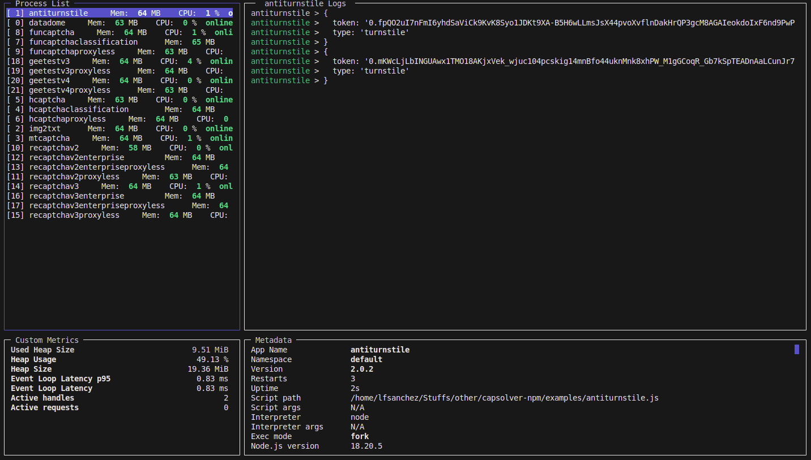

# capsolver-npm-examples

### steps

1. do `npm install`
2. copy-paste `.env.example` to `.env`
3. set `APIKEY` and `PROXYSTRING` (proxy format `ip:port:user:pass`)

### usage

- run all sequentially: `./all.sh`
- run single: (copy-paste from below)
  - `npm run test:balance`
  - `npm run test:custom-task`
  - `npm run test:anticloudflare`
  - `npm run test:antiturnstile`
  - `npm run test:antiturnstileproxyless`
  - `npm run test:datadome`
  - `npm run test:img2txt`
  - `npm run test:mtcaptcha`
  - `npm run test:funcaptchaclassification`
  - `npm run test:funcaptcha`
  - `npm run test:funcaptchaproxyless`
  - `npm run test:geetestv3`
  - `npm run test:geetestv3proxyless`
  - `npm run test:geetestv4`
  - `npm run test:geetestv4proxyless`
  - `npm run test:hcaptcha`
  - `npm run test:hcaptchaclassification`
  - `npm run test:hcaptchaproxyless`
  - `npm run test:recatpchav2`
  - `npm run test:recatpchav2proxyless`
  - `npm run test:recatpchav3`
  - `npm run test:recatpchav3proxyless`

### stress test

- start multiple stress tests `pm2 start pm2/ecosystem.config.js --only=geetestv3,geetestv4`
- to monit: `pm2 monit`
  

- to stop: `pm2 delete all`
